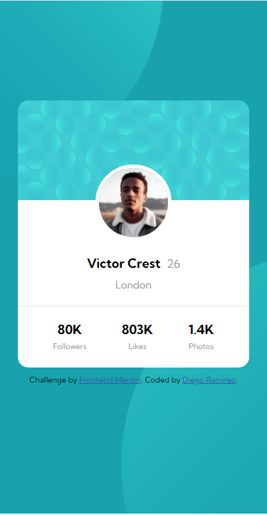

# Frontend Mentor - Profile card component solution

This is a solution to the [Profile card component challenge on Frontend Mentor](https://www.frontendmentor.io/challenges/profile-card-component-cfArpWshJ). Frontend Mentor challenges help you improve your coding skills by building realistic projects. 

### The challenge

- Build out the project to the designs provided

### Screenshot

### Links

- Solution URL: [Front-end Mentor](https://www.frontendmentor.io/solutions/profilecardcomponentmainproject-CySldFjLh)
- Live Site URL: [Vercel](https://profile-card-component-main-psi-vert.vercel.app/)

## Author

- Website - [Linkedin](www.linkedin.com/in/diego-ramirez-jag)
- Frontend Mentor - [@daarfarias](https://www.frontendmentor.io/profile/daarfarias)

